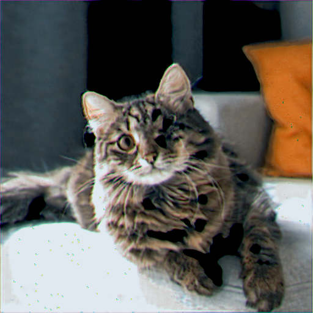
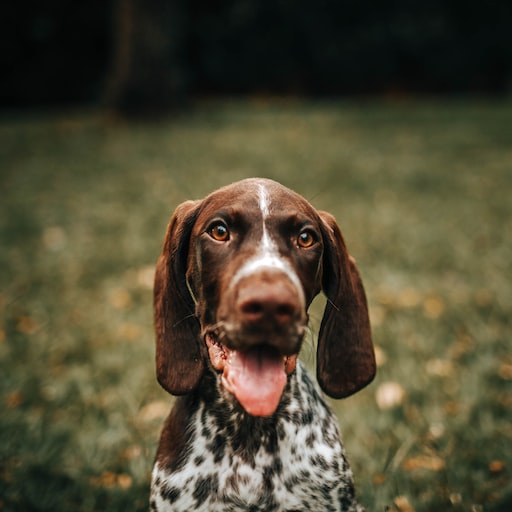
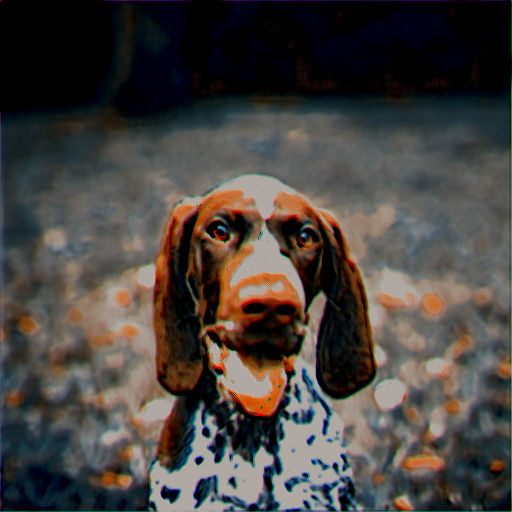
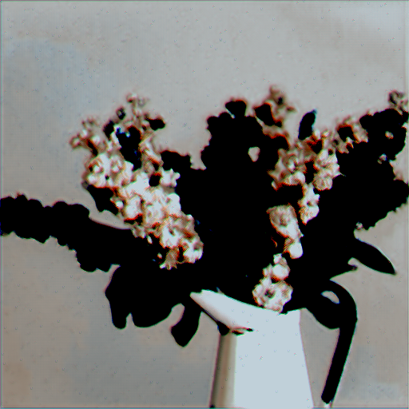

# teeny-latent-diffusion
A repository loosely implementing High-Resolution Image Synthesis with Latent Diffusion Models (2021) in PyTorch. Written for experiments surrounding permissive datasets and data augmentation. Still a work in progress.

## Progress 🚧

### VAE Prior 🧬
The following is a table of VAE reconstructions compared to ground truth, at 23,000 steps.

| Ground Truth | VAE Reconstruction at 23,000 Steps | Credit |
| :---: | :---: | :---: |
|  |  | Photo by Adam Stefanca on [Unsplash](https://unsplash.com/@adam_stefanca) |
|  |  | Photo by Helena Lopes on [Unsplash](https://unsplash.com/@wildlittlethingsphoto) |
|  |  | Photo by Annie Spratt on [Unsplash](https://unsplash.com/@anniespratt) |

### Roadmap 🗺️
- [x] Implement a Denoiser U-Net.
- [x] Implement a VAE prior.
- [ ] Implement a BERT encoder as the LDM's text encoder.
- [ ] Create preprocessor and dataloader for Unsplash-25K.
- [ ] Train LDM on Unsplash-25K dataset.
- [ ] Train LDM+Bert on Unsplash-25K dataset.